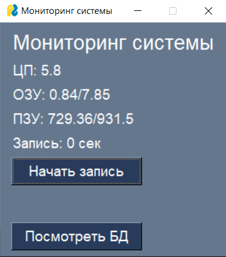
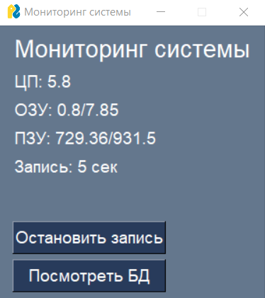
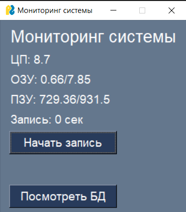
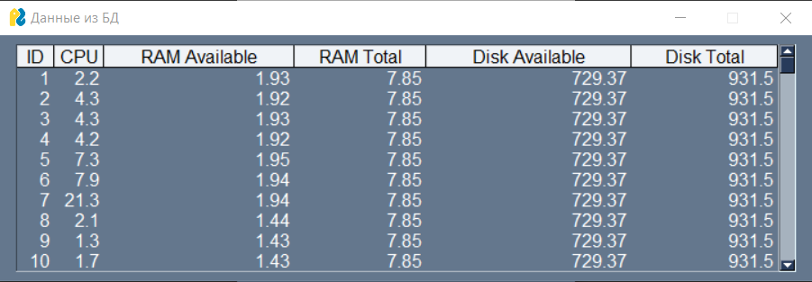
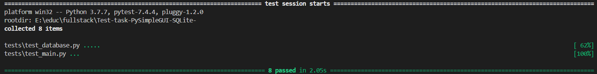

# Тестовое задание на позицию Python Full-stack developer

Этот проект представляет собой desktop приложение, отображающее уровень загруженности ЦП, ОЗУ, ПЗУ, с возможностью записи этой информации в базу данных и отображения в отдельном окне. Графический интерфейс создан с помощью библиотеки PySimpleGUI, база данных -- SQLite.

## Установка

1. Клонируйте репозиторий:

(bash) `git clone https://github.com/Leila132/Test-task-PySimpleGUI-SQLite-.git`

2. Перейдите в директорию проекта:

`cd Test-task-PySimpleGUI-SQLite-`

3. Установите зависимости:

`pip install -r requirements.txt`

## Запуск

Чтобы запустить проект, выполните:

`python main.py`

## Использование

Интерфейс выглядит следующим образом:

После нажатия на кнопку "Начать запись" данные с окна начинают сохраняться в базу данных, начинается отсчет таймера, появляется кнопка "Остановить запись".

При нажатии кнопки "Остановить запись" сохранение информации в бд прекращается, таймер обнуляется.

После нажатия кнопки "Посмотреть БД" открывается второе окно, которое демонстрирует таблицу данных из БД.

## Тестирование

Для запуска тестов используйте команду:

`pytest tests/`

Результаты тестов:

